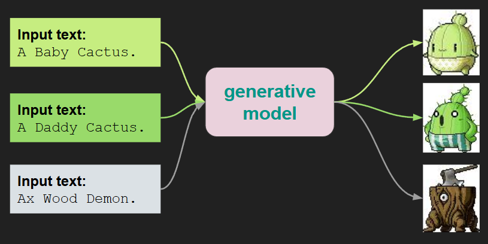
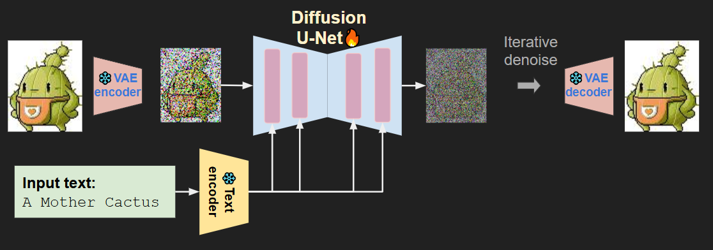
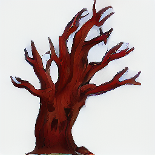
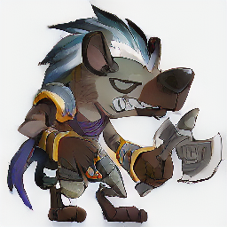
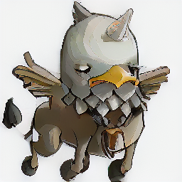
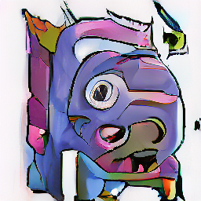

# Conditional-Image-Generation
113-2 電機所 生成式AI HW6 Conditional Image Generation

## Author：國立陽明交通大學 資訊管理與財務金融學系財務金融所碩一 313707043 翁智宏

本次是生成式AI課程的第六次作業，實作一個 Conditional Image Generation（條件式影像生成） 模型，只能利用作業限定的pre-training模型(CLIP、VAE)去將楓之谷中的Monster和動作的prompt當作訓練集，去訓練一個Diffusion Model，然後將模型應用在一個只有動作prompt的Testing，生成對應的Monster圖片。

然後利用FID、CLIP-I、CLIP-T去查看生成表現以及與文字敘述的相似度。

目標是根據輸入文字描述生成對應的怪物圖像。整體流程使用 VAE 獲取潛在圖像空間，並以 UNet2DConditionModel 為核心進行擴散式訓練與生成。

Text guided moster image generation using diffusion model.



Conditional diffusion model (Latent diffusion model) overview.



[任務連結](https://nycubasic.duckdns.org/competitions/3/) 

## Dataset

**train_info.json**: The text descrition for image files.

**train/**: Folder include 43294 training images of about 2000 monsters, each monster has 5 or more actions. The information is provided in train_info.json.

**test.json**: The 1063 target input text you need to generate.

## 🧠 模型架構與訓練策略

### 🔧 使用模組

| 模組名稱              | 用途說明                    | 預訓練來源                          |
|-----------------------|-----------------------------|-------------------------------------|
| `CLIPTextModel`       | 文字編碼器（Text Encoder）   | `openai/clip-vit-base-patch32`     |
| `AutoencoderKL`       | VAE 壓縮潛在空間             | `CompVis/stable-diffusion-v1-4/vae`|
| `UNet2DConditionModel`| 擴散模型主體，從零訓練       | ✘ 無使用預訓練                      |

---

### 🏗 模型設定細節

| 參數                     | 設定值／說明                           |
|--------------------------|----------------------------------------|
| Latent Resolution         | 32 × 32                                |
| Base Channels             | 起始為 256，最終遞增至 768             |
| Cross-Attention Dimension | 512（與 CLIP hidden size 對齊）        |
| Block 結構                | CrossAttnDownBlock2D + UpBlock2D       |
| Batch Size                | 64                                     |
| Optimizer                 | AdamW，學習率 1e-4                     |
| Training Scheduler        | DDPM（去噪擴散模型）                   |

---

### 📉 損失函數設定（Loss Functions）

| 損失函數     | 使用時機       | 說明                                       |
|--------------|----------------|--------------------------------------------|
| MSE Loss     | 全程           | 基礎噪聲預測                               |
| LPIPS Loss   | 第 130 epoch 開始 | 提升感知品質，使用 0.1 權重                 |
| KL Loss      | 第 260 epoch 開始 | 維持潛在空間穩定性，使用 0.01 權重         |

### 🛠️ 訓練技巧
Classifier-Free Guidance（10% caption 留白）

混合精度訓練（AMP, torch.cuda.amp）

梯度累積與 clipping（accumulation = 2）

每 epoch 儲存 checkpoint 並預覽圖片

## 🎨 圖像生成策略（Sampling Strategy）

| 項目             | 設定內容                              |
|------------------|---------------------------------------|
| Scheduler         | `DPMSolverMultistepScheduler`（DPM++） |
| Guidance Scale    | 8.0（Classifier-Free Guidance）       |
| Sampling Steps    | 130                                   |
| Batch Size        | 32                                    |
| 推理方式          | Condition 與 Uncondition embedding 分別計算 |

---

## 📈 評估結果（Results & Evaluation）

| 指標   | 分數     | 備註                            |
|--------|----------|---------------------------------|
| FID    | 82.6531  | 優於 baseline (90)，代表圖片自然度佳 |
| CLIP-I | 0.800509 | 高於 baseline (0.75)，圖像與真實圖更相似 |
| CLIP-T | 0.291647 | 高於 baseline (0.27)，圖文對齊度佳     |

## 🧪 額外實驗（Additional Experiments）
- 加入 LPIPS Loss：雖然訓練時間由 11 分鐘增至 27 分鐘，但生成品質明顯提升。
- 更換 Scheduler 為 DPM++：提升生成穩定性與速度。
- 加入 EMA（指數移動平均）：因訓練中途插入導致 weight 不同步，結果反而變差。
- 過度資料增強：在模型已收斂階段加入強增強反而降低品質。

---

## 輸出結果
```
prompts = [
        "A red tree monster with a skull face and twisted branches.",
        "Blood-toothed monster with spiked fur, wielding an axe, moving fiercely.",
        "Gray vulture monster with wings, sharp beak, and trident.",
        "Small purple fish-like creature with one giant eye and pink fins, being hit."
    ]
```






